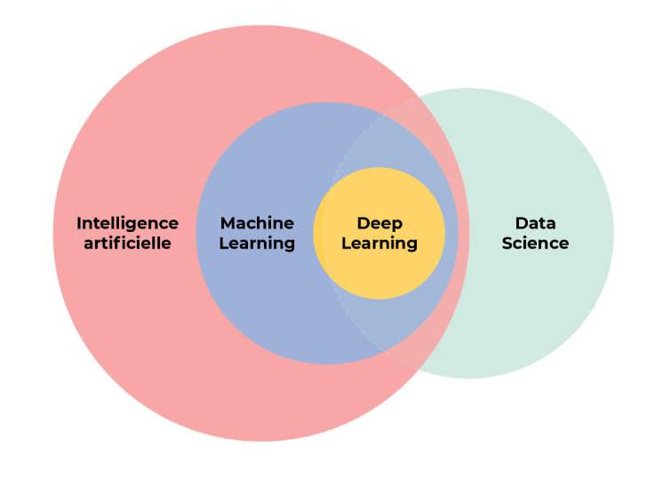

# MUSIC_RECOMMENDATION

> Here is my personal project of how i can manage to init Machine Learning algorithm in order to recommend a bunch of songs based on input music. First, lets try to understand what is AI, Machine Learning, Deep Learning and Data Science.

## GENERAL KNOWLEDGES

- L'IA c'est toute technologie informatique algorithmique qui permet de résoudre des problèmes complexes qu'on aurait cru réservés à l'intelligence humaine, en simulant des capacités humaines comme la perception et le raisonnement.

- Les programmes d’IA sont effectivement plus puissants que l’humain sur des sujets spécifiques et peuvent être détournés pour des usages malveillants, ils ne sont en revanche pas capables à l’heure actuelle d’être performant sur toutes les tâches où l’humain est performant. Ils peuvent exprimer des émotions humaines, mais celles-ci seront forcément simulées. En revanche, que ces systèmes soient dotés d’émotions ou non, ce qui importe c’est aussi la manière dont l’humain va percevoir l'interaction avec l’IA et réagir.

### Objectifs de l'IA 

- Détecter les maladies plus tôt
- Faciliter la prise de décision médicale
- Aider l'apprentissage de l'écriture
- Prévenir les crises planétaires
  
### Enjeux de sûreté de l'IA

- Les fausses informations (le deepfake)
- Attaques par phishing
- Usurpation d'identité
- La sûreté de l'IA concerne trois grands problèmes:
    - la robustesse : cybersécuriser l'IA
    - l'explicabilité : l'IA fonctionne en autonomie sans que l'on sache réellement ni comment ni pourquoi.  Les systèmes d’IA par apprentissage machine           s'appuient sur des données et des méthodes de raisonnement statistiques afin d’apprendre des corrélations. Néanmoins ces corrélations ne reflètent pas        nécessairement un lien de causalité.
    - la spécification des objectifs : si l'on manque de nuances, l'IA ne pourrait pas satisfaire nos attentes.

### Enjeux des données

- Controler l'utilisation de nos données personnelles
- Enjeux écologiques

### Différentes étapes d'un projet IA

- Récuperation des données :
    - Il faut récupérer de la donnée pertinente, sans données, impossible d'assurer le succès d'un projet IA.
- Nettoyer les données :
-     Regarder s'il n'y pas des données manquantes
-     S'assurer qu'il n'y a pas de données aberrantes
- Explorer les données :
-     Se poser les bonnes questions sur la manière dont on souhaite étudier ces données
-     Permet de verifier les hypothèses ou intuitions
- Modéliser les données :
-     Objectif c'est d'anticiper, pour cela on va utiliser le Machine Learning
-     Première phase : l'apprentissage, entrainement du modèle avec des exemples, donc des données.
-     Deuxième phase : prédiction
- Evaluez et interprétez les données :
-     Confirmer si oui ou non les prévisions qu'il fournit sont de qualité

### Le Machine Learning

- Definir un pb
- Choisir un modèle sur lequel s'appuyer
-     Un modèle est une représentation mathématique d'un problème donné.
-     Créer un programme capable de collecter toutes les données disponibles pour un problème donné, et d’apprendre lui-même à partir de ces données pour construire son propre modèle.
- L'apprentissage
-      Etape qui permet de construire notre modèle : On fournit à l'algorithme de nombreux exemples à analyser pour qu'il puisse apprendre par l'expérience.
-      Apprentissage supervisé:
-      Apprentissage non supervisé: On ne sait pas à l'avance ce qu'on va trouver, il n'y a pas d'étiquettes
-      Apprentissage par essai/erreur: agent, qui intéragit avec un environnement. Son objectif est de trouver par tâtonnements successifs (essai ou erreur) la solution optimale à un problème donné. On dit que cet algorithme est auto-adaptatif : il est en apprentissage constant.

### Le Deep Learning

- 
